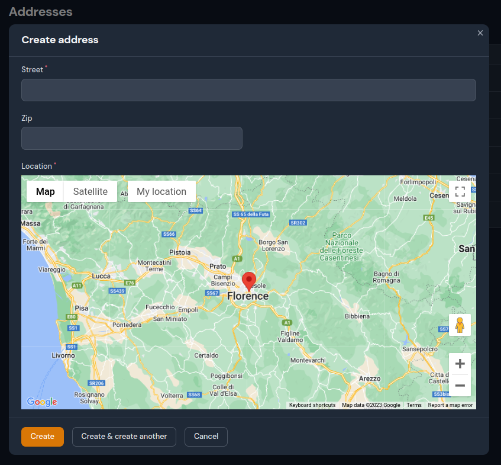

# Filament LocationPickr Field


This package provides just a simplified location picker field within [Filament](https://filamentphp.com) using Google Maps based on the excellent work of [Hugh Messenger](https://filamentphp.com/plugins/cheesegrits-google-maps).

## Installation

You can install the package into a Laravel app that uses [Filament](https://filamentphp.com) via composer::

```bash
composer require arbermustafa/filament-locationpickr-field:"^2.0.0"
```

**Filament V2** - if you are using Filament v2.x, you can use [1.x](https://github.com/arbermustafa/filament-locationpickr-field/tree/1.x) branch.

You can publish the config file with:

```bash
php artisan vendor:publish --tag=filament-locationpickr-field-config
```

The `config` file contains default global customization options for map rendering, like: api key, default location, etc.

Optionally, you can publish the view using:

```bash
php artisan vendor:publish --tag=filament-locationpickr-field-views
```

## Setting your Google Maps API Key

All use of the Google Maps API requires an API key. If you don't have one, refer to [Google's documentation](https://developers.google.com/maps/documentation/javascript/get-api-key).

Once you have a key, either add it to your .env file as:

```
GMAP_API=your_map_api_key_here
```

... or publish and edit the `filament-locationpickr-field.php` config file.

## Preparing the models

Add a `location` column to any model migration schema used for map data

```php
...

Schema::table('table_name', function (Blueprint $table) {
    $table->json('location')->nullable();
});

...
```

and add the column to the model fillable array

```php
...

protected $fillable = [
    ...
    'location',
];
```

If you have separate columns for `lat` and `lng` you can use a computed property on any model being used for map data and use a mutator which converts between separate lat and lng fields on your table, and a Google Point style array of 'lat' and 'lng' keys.

```php
...

protected $appends = [
    ...
    'location',
];

...

public function location(): Attribute
{
    return Attribute::make(
        get: fn ($value, $attributes) => json_encode([
            'lat' => (float) $attributes['lat'],
            'lng' => (float) $attributes['lng'],
        ]),
        set: fn ($value) => [
            'lat' => $value['lat'],
            'lng' => $value['lng'],
        ],
    );
}

...
```

## Usage

### Form field

The form field can be used with no options, by simply adding this to your Filament Form schema:

```php
use ArberMustafa\FilamentLocationPickrField\Forms\Components\LocationPickr;
...

    ->schema([
        ...
        LocationPickr::make('location'),
        ....
    ]);
...
```

The name used in the `make()` function must be the one you set up as your model's column/computed location property.

### Full options

The full set of options is as follows. All option methods support closures, as well as direct values.

```php
use ArberMustafa\FilamentLocationPickrField\Forms\Components\LocationPickr;
...

    ->schema([
        ...
        LocationPickr::make('location')
            ->mapControls([
                'mapTypeControl'    => true,
                'scaleControl'      => true,
                'streetViewControl' => true,
                'rotateControl'     => true,
                'fullscreenControl' => true,
                'zoomControl'       => false,
            ])
            ->defaultZoom(5)
            ->draggable()
            ->clickable()
            ->height('40vh')
            ->defaultLocation([41.32836109345274, 19.818383186960773])
            ->myLocationButtonLabel('My location'),
        ....
    ]);
...
```

#### Example usage in simple resource



## Changelog

Please see [CHANGELOG](CHANGELOG.md) for more information on what has changed recently.

## Contributing

If you want to contribute to this package, you may want to test it in a real Filament project:

-   Fork this repository to your Github account.
-   Create a Filament app locally.
-   Clone your fork in your Filament app root directoy.
-   In the `/filament-locationpickr-field` directory, create a branch for your fix/improvement, e.g. `fix/pickr-field`.

Install the package in your app's `composer.json`:

```json
"require": {
    "arbermustafa/filament-locationpickr-field": "dev-fix/pickr-field as dev-main",
},
"repositories": [
    {
        "type": "path",
        "url": "./filament-locationpickr-field"
    }
]
```

Now run `composer update`.

## Security Vulnerabilities

Please review [our security policy](../../security/policy) on how to report security vulnerabilities.

## Credits

-   [Arber Mustafa](https://github.com/arbermustafa)
-   [Hugh Messenger](https://github.com/cheesegrits)
-   [All Contributors](../../contributors)

## License

The MIT License (MIT). Please see [License File](LICENSE.md) for more information.
